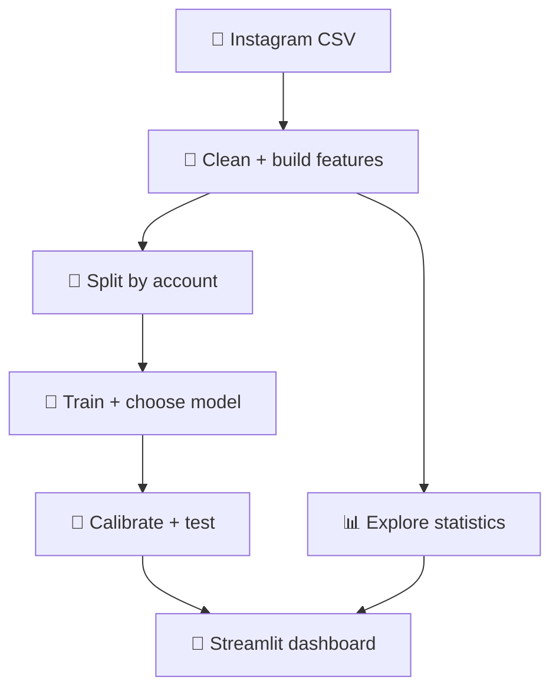

<div align="center">

# 🌸 InstaClay 🌸
### Your little Instagram engagement studio


**Plan a post ✍️ · Explore patterns 📊 · Compare ideas 💕**


**୨୧ Made for curious minds & creative post ideas ୨୧**

</div>

---

## 🐰 What is InstaClay?

A cute Streamlit app that explores Instagram data and estimates **likes + comments** from your planned post details.

> 🌷 **Keep expectations realistic:** this is an academic ML project. Its predictions have limited reliability; it cannot promise likes or virality.

## 🎀 What’s inside?

| 🌸 Page | ✨ What it does |
|---|---|
| 🏡 Overview | Shows post counts, engagement charts, and content mix |
| 🔮 Predict a post | Estimates interactions with an 80% prediction range |
| 💕 Compare two posts | Compares two ideas and shows uncertainty |
| 📊 Statistics | Explores formats, timing, and caption patterns |
| 🤖 Model performance | Shows the models’ real test results |
| 🧹 Data & methods | Explains cleaning, features, and limitations |

**Soft colors + rounded cards + gentle shadows = light claymorphism ☁️**

## 🚀 Start in 3 steps

### ① 🐍 Use Python 3.14.2

Check your installed version:

```powershell
python --version
```

### ② 📂 Extract & open

Extract the project ZIP fully. Open the **instaclay** folder in VS Code.

### ③ ▶️ Run!

```powershell
.\start_windows.bat
```

The launcher creates `.venv314`, installs packages, checks the model, and starts the app. First setup needs internet. 💻

🌐 Open **[localhost:8501](http://localhost:8501)** if needed.  
🛑 Keep the terminal open; press **Ctrl+C** to stop.

> 🐾 Use the **Python 3.14.2 project ZIP** with this README. You can also double-click its `start_windows.bat`.

## ✍️ Try your first prediction

1. 🔮 Open **Predict a post**.
2. 💬 Enter your caption and hashtags.
3. 🖼️ Choose the post format.
4. 🕒 Choose date, time, and timezone.
5. ✨ Click **Estimate engagement**.
6. 📥 Read the estimate and range, or download the result.

**Example input:** a photo caption + `#art #design` + Image + planned posting time.

💕 Want to compare two ideas? Open **Compare two posts**. If their ranges overlap, there is no clear winner within that uncertainty.

## 🧺 Our data, simply explained

| 🧸 Detail | 🌷 Value |
|---|---:|
| Raw posts | 1,000 |
| Raw columns | 40 |
| Usable posts | 888 |
| Rows excluded for missing likes | 112 |
| Content formats | Image · Carousel · Reel · Video |
| Median likes + comments | 71 |

📌 This build contains **1,000 raw posts**, not the previously discussed 7,730-post dataset.

🧹 Cleaning removes invalid targets, checks IDs/timestamps, tidies captions, and deduplicates hashtags. Missing likes are **not** treated as zero.

## 🧠 What does the model look at?

**💬 Caption:** characters, words, mentions, `!`, and `?`  
**🏷️ Hashtags:** unique hashtag count  
**🕒 Timing:** posting hour and weekday, converted to UTC  
**🖼️ Format:** Image, Carousel, Reel, or Video

It does **not** understand caption meaning or inspect your photo/video. Different wording can give the same estimate if these features stay identical. 🐣

Likes/comments form the target. Views, IDs, and collection-time followers are excluded from predictors.

## 🪄 How it works



🧺 **Split:** 532 training · 178 calibration · 178 test posts.  
🔁 **Selection:** five-fold grouped cross-validation on training data.  
📏 **Learning target:** `log(1 + likes + comments)`, converted back to counts.

## 🤖 Meet the models

| Model | Simple explanation |
|---|---|
| 🐢 Median baseline | Gives the same typical estimate to every post |
| 📏 Linear Regression | Learns a linear relationship from the features |
| 🌳 Random Forest | Combines many decision trees |
| 🌱 Gradient Boosting | Builds trees that improve earlier predictions |

**🌳 Deployed model: Random Forest** — 300 trees, selected by lowest training CV RMSLE.

## 🎯 How accurate is it?

**There is no honest single “accuracy %” for this regression app.** These are the actual results on 178 unseen test posts:

| Model | MAE ↓ | RMSLE ↓ | Raw R² ↑ |
|---|---:|---:|---:|
| 🐢 Baseline | 4,481.13 | 2.4828 | −0.0233 |
| 📏 Linear Regression | 4,477.28 | 2.3987 | −0.0214 |
| 🌳 **Random Forest** | **4,473.64** | **2.4032** | **−0.0223** |
| 🌱 Gradient Boosting | 4,493.33 | 2.4691 | −0.0194 |

- 📏 **MAE:** average absolute error in likes + comments; viral posts strongly affect the average.
- 📉 **RMSLE:** error on a logarithmic scale; smaller is better.
- ⚠️ **Negative R²:** worse squared count error than the test-mean benchmark.

**Honest takeaway:** the app works, but the dataset supports weak predictions. Audience information and a consistent measurement window are missing. 🌧️

### ☁️ What does the 80% range mean?

The calibrated range covered **79.21% of held-out outcomes**. That is **coverage, not prediction accuracy**. Ranges can be wide, and future data may behave differently.

The estimate is **total observed interactions**, not engagement rate or a seven-day forecast.

## 📊 Statistics in a tiny nutshell

| Tool | What it helps explain |
|---|---|
| 🧮 Descriptive statistics | Typical values and spread |
| 🎲 Bootstrap | Uncertainty around median engagement |
| 🔗 Spearman correlation | Whether features move together |
| ⚖️ Kruskal–Wallis | Whether group distributions differ |
| 🛡️ Holm correction | Adjusts for multiple comparisons |
| 📐 Epsilon squared | Estimated size of group differences |
| 🔍 Permutation importance | Which inputs affect model scoring |

🌷 **Findings:** content formats differ statistically, with a small estimated effect. Time blocks and weekdays show no significant difference in this sample. Median engagement is **71**, with a bootstrap interval of **59–87**.

🐾 Associations do not prove that changing a caption, hashtag, or posting time causes better engagement.

## 📁 Where is everything?

| File / folder | Purpose |
|---|---|
| `app.py` | 🌸 Dashboard |
| `core.py` | 🧹 Cleaning and prediction helpers |
| `train.py` | 🤖 Training and statistics |
| `bootstrap.py` | 🚀 Startup checks |
| `data/` | 🧺 Raw Instagram sample |
| `artifacts/` | 📊 Model, results, and cleaned data |
| `tests/` | ✅ Automated checks |
| `.vscode/` | 💻 VS Code launch settings |
| `requirements.txt` | 📦 Dependencies |

**Stack:** Python · Streamlit · pandas · NumPy · scikit-learn · SciPy · Plotly · joblib · tzdata 🛠️

## 🔁 Retrain or test

Stop the app before retraining:

```powershell
.\retrain_windows.bat
```

Run the tests after setup:

```powershell
.\.venv314\Scripts\python.exe -m unittest discover -s tests -v
```

Retraining replaces model/analysis files. Restart Streamlit afterward. Fixed seeds, exported splits, and recorded versions help reproduce the results. 🔬

## 🩹 Quick fixes

| Problem | Fix |
|---|---|
| 🐍 Python not found | Check Python 3.14, then restart VS Code |
| 📦 Installation failed | Read the first pip error and check internet access |
| 🔌 Port 8501 is busy | Stop the earlier Streamlit app |
| 🤖 Model cannot load | Run `retrain_windows.bat` |
| 🔄 Old results still appear | Restart Streamlit |

✅ Training, dashboard tests, and server startup passed on **Python 3.14.2 on Linux**. Windows 64-bit dependency packages were verified. Native Windows batch execution was not tested.

## 🌱 Future ideas

📚 More labeled data · 👥 Verified pre-post audience size · 🖼️ Image features · 💬 Caption meaning · 🗓️ Fixed engagement measurement window

*These are future improvements, not current features.*

## 📌 Before sharing on GitHub

Exclude virtual environments/caches, check dataset redistribution rights, and choose a license. Public dashboards can expose downloadable data. Only load trusted joblib models. 🔐

---

<div align="center">

### 🐰 🌸 ☁️ 🎀 ✨
**Plan thoughtfully. Measure honestly.**

*Statistics for Machine Learning and Data Science*  
**Made with curiosity & pastel pixels ♡**

</div>
