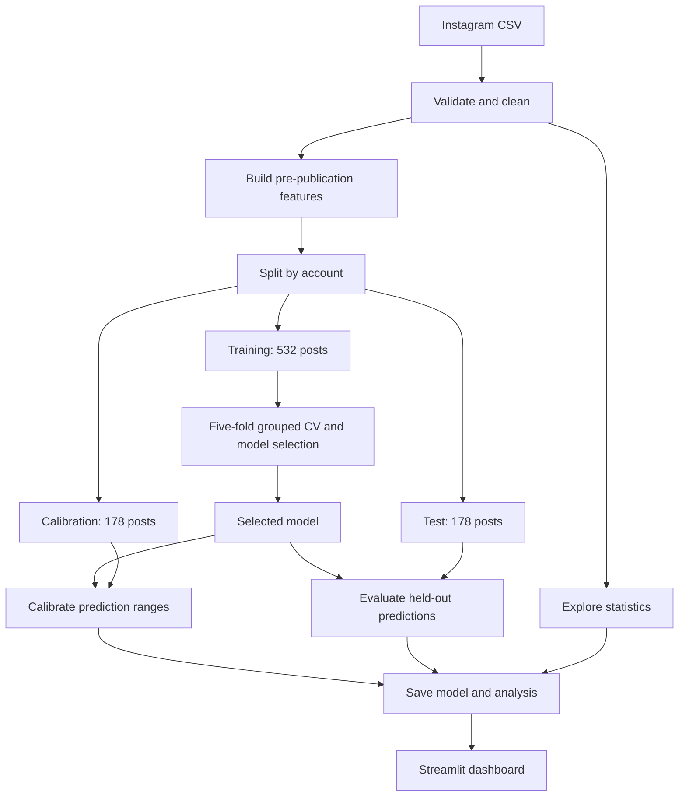

<div align="center">

# ◉ InstaClay
### Instagram Engagement Studio

**Social Media Engagement Prediction Using Statistical Analysis and Machine Learning**

A light-mode Streamlit dashboard for exploring Instagram posts, estimating engagement, and comparing planned posts with measurable uncertainty.


[Quick start](#-quick-start-on-windows) · [Features](#-dashboard-features) · [Workflow](#-project-workflow) · [Results](#-actual-model-performance) · [Methods](#-statistical-analysis)

</div>

---

## 💡 What this project does

InstaClay combines data cleaning, statistical analysis, regression models, and an interactive dashboard in one academic project. Enter the details of an Instagram post before publishing and receive an experimental estimate of its **total likes + comments**, alongside an **80% prediction range**.

The dashboard also helps you inspect engagement patterns, compare two post ideas, and understand how the models performed on held-out data.

> **Read this before interpreting predictions:** this dataset produces weak predictive performance. The selected model has a negative test R² on raw engagement counts. InstaClay demonstrates a complete, evaluated machine-learning workflow; it does not provide precise engagement forecasts or guaranteed virality.

## ✨ Dashboard features

| Workspace | What you can do |
|---|---|
| **Overview** | Inspect usable-post counts, median engagement, content formats, engagement distribution, and content mix. |
| **Predict a post** | Enter a caption, extra hashtags, format, date, time, and timezone; get a point estimate, prediction range, and downloadable CSV. |
| **Compare two posts** | Compare estimates for Post A and Post B; inspect their difference, overlapping ranges, and export the comparison. |
| **Statistics** | Filter formats; inspect box plots, hourly medians, Spearman correlations, descriptive statistics, and hypothesis tests. |
| **Model performance** | Compare training cross-validation and test metrics; inspect actual-versus-predicted plots and permutation importance. |
| **Data & methods** | Review the cleaning audit, input features, validation splits, limitations, and downloadable analysis files. |

The interface uses pastel colors, rounded cards, soft shadows, responsive layouts, and light claymorphism styling. Reduced-motion preferences are respected by the custom CSS.

## 🚀 Quick start on Windows

### 1. Check Python

This edition targets **64-bit Python 3.14.2**. In PowerShell or the VS Code terminal, run:

```powershell
python --version
```

Expected for the tested edition:

```text
Python 3.14.2
```

The launcher accepts Python 3.14 through either `py -3.14` or `python`; other 3.14 patch versions have not been separately validated.

### 2. Extract and open the project

Extract the ZIP completely into a new folder. In VS Code, select **File → Open Folder → instaclay**. Your working folder should contain `app.py`, `bootstrap.py`, `requirements.txt`, and `start_windows.bat`.

### 3. Start the dashboard

```powershell
.\start_windows.bat
```

You can also double-click `start_windows.bat` in File Explorer.

On startup, the Windows launcher:

1. Detects Python 3.14.
2. Creates an isolated `.venv314` environment on your computer.
3. Installs the required packages on first launch, then reuses them on later launches.
4. Checks the dataset fingerprint, model assets, and relevant runtime versions.
5. Retrains when required files are missing, the data changes, or model compatibility checks fail.
6. Starts Streamlit and requests that it open your browser.

Initial installation needs internet access. The dashboard itself uses local data and models, without an Instagram login, external API, or API key.

### 4. Open and stop the app

Open **[http://localhost:8501](http://localhost:8501)** if your browser does not open automatically. Keep the terminal window open while using the app. Press **Ctrl+C** to stop it; answer `Y` if Windows asks whether to terminate the batch job.

### Manual setup instead of the launcher

Run these commands from the project folder:

```powershell
python -m venv .venv314
.\.venv314\Scripts\python.exe -m pip install --only-binary=:all: -r requirements.txt
.\.venv314\Scripts\python.exe -m streamlit run app.py --server.headless false
```

The manual route uses the bundled assets directly. Use the Windows launcher when you want its model and dataset checks. No virtual-environment activation or PowerShell execution-policy change is needed.

### VS Code debugging

After initial setup, install the recommended Python extensions. Select `.venv314\Scripts\python.exe` through **Python: Select Interpreter**. In **Run and Debug**, choose **InstaClay: Streamlit** and press **F5**.

Launch `app.py` through Streamlit; VS Code's ordinary **Run Python File** command does not start the dashboard correctly.

## 🧭 How to use the app

1. **Review the sample:** open Overview and Data & methods to understand the available data and cleaning decisions.
2. **Explore patterns:** use Statistics to inspect distributions, format differences, and posting-hour summaries.
3. **Plan a post:** open Predict a post and enter caption, hashtags, format, date, time, and timezone.
4. **Read the result:** inspect both the estimated likes + comments and its prediction range. A broad range indicates substantial uncertainty.
5. **Compare ideas:** enter two plans in Compare two posts. Overlapping ranges mean the app cannot identify a clear winner within that uncertainty.
6. **Check reliability:** use Model performance to inspect errors and download results before drawing conclusions.

Changing caption wording can produce identical predictions when the structural features stay the same. The model does not understand caption meaning or inspect the image/video.

## 📦 Dataset included

| Property | Actual bundled data |
|---|---:|
| Source file | `data/instagram_posts.csv` |
| Raw rows | 1,000 |
| Raw columns | 40 |
| Usable labeled posts | 888 |
| Accounts in cleaned data | 888 |
| Rows excluded for missing/invalid targets | 112 |
| Duplicate post IDs removed | 0 |
| Missing captions in raw data | 36 |
| Missing hashtag fields in raw data | 366 |
| Median cleaned engagement | 71 |
| Largest cleaned engagement | 282,623 |
| Historical posting dates | March 2013–December 2025 |

The raw sample contains **Image, Carousel, Reel, and Video** posts. This build uses the bundled **1,000-row sample**, not a 7,730-row dataset. Dataset provenance and redistribution permission were not independently verified; check the source's terms before publishing the raw CSV on GitHub.

**Prediction target:**

```text
engagement = likes + num_comments
```

This is a count of observed interactions, **not engagement rate**. Likes and comments are not predicted separately. Because the dataset lacks a fixed measurement window, the estimate cannot be called a 24-hour or seven-day forecast.

## 🔄 Project workflow



### Cleaning and preparation

- Validate the required CSV columns and remove duplicate post IDs.
- Convert likes/comments to numeric values; exclude missing, negative, nonfinite, or noninteger target counts.
- Parse timestamps in UTC and exclude invalid timestamps or missing required identifiers/formats.
- Normalize caption text with Unicode NFKC and whitespace cleanup; treat missing captions as empty text.
- Extract hashtags from captions and serialized hashtag lists; deduplicate them without case sensitivity.
- Preserve valid viral outliers instead of deleting them to improve reported metrics.
- Export the cleaned dataset and a machine-readable audit.

### Inputs used by the model

| Input | Representation |
|---|---|
| Caption length | Number of normalized caption characters |
| Word count | Number of whitespace-separated words |
| Hashtag count | Number of unique extracted hashtags |
| Mention count | Number of detected `@mentions` |
| Exclamation count | Number of `!` characters |
| Question count | Number of `?` characters |
| Posting hour | Sine and cosine of fractional UTC hour |
| Posting weekday | Sine and cosine of UTC weekday |
| Content format | One-hot encoded Image/Carousel/Reel/Video |

These create **10 numeric features plus one categorical feature** before encoding. Cyclic time features preserve the relationship between midnight and the end of the day. The planner converts the selected timezone to UTC before feature extraction.

**Excluded predictors:** likes, comments, engagement scores, views, post IDs, account IDs, followers, account post counts, and account flags. Likes/comments are the target. Account IDs are used for splitting only. Collection-time account statistics are excluded because the file does not establish that they were available before publication.

## 🤖 Models and training

| Candidate | Purpose |
|---|---|
| Median baseline | A simple benchmark that ignores post features |
| Linear Regression | A linear relationship between features and log engagement |
| Random Forest Regressor | An ensemble of trees for nonlinear relationships |
| Histogram Gradient Boosting Regressor | Boosted trees fitted to log engagement |

All candidates learn **`log(1 + engagement)`** to reduce the influence of extreme counts. Predictions are converted back with `expm1` and bounded to nonnegative values. This approach emphasizes errors on a logarithmic scale; it does not estimate an unbiased arithmetic mean of raw counts.

Numeric preprocessing uses median imputation and standard scaling. Content format uses one-hot encoding with unseen-category handling. Preprocessing and models are combined in a scikit-learn pipeline so learned transformations are fitted within each cross-validation fold.

### Validation and selection

- Fixed, seeded account-disjoint training/calibration/test split.
- Five-fold `GroupKFold` cross-validation within the training set.
- `GridSearchCV` tuning, minimizing clipped log-scale RMSE.
- Separate calibration data for the 80% prediction range.
- Held-out test data for final evaluation, without using it to choose the deployed model.

**Selected model: Random Forest** with 300 trees, `min_samples_leaf=20`, `max_features=0.7`, and `random_state=42`.

| Model | Training CV RMSLE ↓ | Fold standard deviation |
|---|---:|---:|
| **Random Forest** | **2.4223** | 0.2586 |
| Linear Regression | 2.4405 | 0.2844 |
| Median baseline | 2.4877 | 0.2649 |
| Gradient Boosting | 2.6207 | 0.1897 |

The standard deviations describe variation between folds; they are not confidence intervals. Linear Regression performs slightly better on test RMSLE, but Random Forest remains deployed because selection was based on training cross-validation.

## 📊 Actual model performance

These results come from **178 held-out test posts** after rebuilding with Python 3.14.2.

| Model | MAE ↓ | RMSE ↓ | Raw R² ↑ | RMSLE ↓ | Log R² ↑ |
|---|---:|---:|---:|---:|---:|
| Median baseline | 4,481.13 | 29,285.19 | −0.0233 | 2.4828 | −0.0002 |
| Linear Regression | 4,477.28 | 29,257.89 | −0.0214 | 2.3987 | 0.0664 |
| **Random Forest — deployed** | **4,473.64** | **29,270.14** | **−0.0223** | **2.4032** | **0.0629** |
| Gradient Boosting | 4,493.33 | 29,229.20 | −0.0194 | 2.4691 | 0.0108 |

### What “accuracy” means here

This is a regression problem. There is **no single classification-style accuracy percentage** in the implementation.

| Metric | Interpretation |
|---|---|
| MAE | Average absolute error in likes + comments; selected model: about 4,474 interactions. |
| RMSE | Gives more weight to large mistakes; viral outliers strongly affect this value. |
| Raw R² | Negative means worse squared count error than the test-mean benchmark. |
| RMSLE | Measures error on the `log(1 + engagement)` scale; lower is better. |
| Log R² | Selected model explains only about 6.3% of held-out log-target variation. This is not “6.3% accuracy.” |

**Conclusion:** the available post features have limited predictive power. Missing audience information, heterogeneous accounts, and an inconsistent observation horizon prevent precise forecasts. The reported mean error is dominated by large counts and should not be interpreted as the expected error for every individual post.

### Prediction ranges

The project uses split-conformal calibration with absolute residuals on the log scale and a finite-sample quantile.

- **Nominal coverage:** 80%.
- **Observed test coverage:** 79.21%.
- The range concerns an individual post outcome, not a confidence interval for average engagement.
- Coverage depends on exchangeability and may deteriorate when accounts or posting conditions change.
- **79.21% coverage is not 79.21% prediction accuracy.** A broad interval can cover an outcome while the point estimate remains inaccurate.

## 📐 Statistical analysis

| Technique | Use in the project |
|---|---|
| Descriptive statistics | Counts, mean, standard deviation, quantiles, minimum, and maximum |
| Bootstrap | 2,000 resamples for a 95% interval around median engagement |
| Spearman rank correlation | Associations between structural caption features and engagement |
| Kruskal–Wallis test | Compare engagement distributions across format, time block, and weekday |
| Holm correction | Adjust p-values for multiple tests within each test family |
| Epsilon squared | Rank-based effect-size estimate for group comparisons |
| Permutation importance | Inspect changes in model score after shuffling each feature |

**Median engagement:** 71 interactions; **95% bootstrap interval:** 59–87.

| Group comparison | Holm-adjusted p-value | Epsilon squared | Result at α = 0.05 |
|---|---:|---:|---|
| Content format | 4.38 × 10⁻⁷ | 0.0358 | Evidence of distribution differences, with a small estimated effect |
| UTC time block | 0.7422 | 0.000154 | No statistically significant difference detected |
| Weekday | 0.8975 | 0.0000 | No statistically significant difference detected |

Mention count has a weak positive Spearman association with engagement (`ρ ≈ 0.211`); hashtag count has a weak negative association (`ρ ≈ −0.149`). Both remain significant after the separate correlation-family Holm correction.

These are observational associations. They do not prove that adding mentions or reducing hashtags causes higher engagement. Nonsignificant tests do not prove that posting time has no effect. The format test does not identify which individual format pairs differ; no pairwise post-hoc analysis is implemented.

## 🛠️ Technology stack

| Component | Version / role |
|---|---|
| Python | 3.14.2 — validated runtime |
| Streamlit | 1.65.0 — dashboard and forms |
| pandas | 2.3.3 — data processing |
| NumPy | 2.3.5 — numerical operations |
| scikit-learn | 1.8.0 — preprocessing, training, validation, and evaluation |
| SciPy | 1.17.0 — statistical tests |
| Plotly | 7.1.0 — interactive charts |
| joblib | 1.5.3 — model serialization |
| tzdata | ≥2025.2 — timezone data, including Windows support |

Direct dependencies are recorded in `requirements.txt`; transitive dependencies are resolved by pip.

## 🗂️ Project files

| Path | Contents |
|---|---|
| `app.py` | Streamlit interface and dashboard pages |
| `core.py` | Shared cleaning, feature extraction, prediction, and interval functions |
| `train.py` | Statistics, model tuning, calibration, evaluation, and export |
| `bootstrap.py` | Dependency checks, model validation, and Windows startup orchestration |
| `requirements.txt` | Direct runtime dependencies |
| `start_windows.bat` | Windows setup and launch |
| `retrain_windows.bat` | Retraining followed by launch |
| `start_unix.sh` | macOS/Linux setup and launch |
| `data/instagram_posts.csv` | Bundled raw dataset |
| `artifacts/model.joblib` | Trained pipelines and calibration information |
| `artifacts/report.json` | Audit, results, runtime versions, and dataset SHA-256 |
| `artifacts/*.csv` | Cleaned data, statistics, split membership, metrics, and test predictions |
| `artifacts/training_python314.txt` | Python 3.14.2 training log |
| `tests/test_project.py` | Data, feature, prediction, and interface tests |
| `.streamlit/config.toml` | Light theme and Streamlit settings |
| `.vscode/` | Interpreter, debug, and extension settings |
| `Dockerfile` | Container based on Python 3.14.2 |
| `WINDOWS_SETUP.md` | Windows instructions and troubleshooting |
| `RESULTS.md` / `VALIDATION.md` | Measured results and validation scope |
| `manifest.json` | File checksums from the packaged build |

## 🔁 Retrain and reproduce

Stop the dashboard before retraining.

```powershell
.\retrain_windows.bat
```

Or run training and tests directly after setup:

```powershell
.\.venv314\Scripts\python.exe train.py
.\.venv314\Scripts\python.exe -m unittest discover -s tests -v
```

Training overwrites the analysis and model files in `artifacts/`. Restart Streamlit afterward to clear its cached model/data. Seeds are fixed, account splits are exported, and the data fingerprint and key library versions are saved in `report.json`. Exact reproducibility also depends on the same data and software environment.

Replacing the dataset requires the same expected schema and a review of data quality, splits, and results. The existing test suite includes an assertion for the bundled sample's 888 usable rows; update that expectation deliberately if you replace the data. Avoid repeated tuning against the saved test set.

### macOS / Linux

With Python 3.14 installed, run:

```bash
bash start_unix.sh
```

The Unix script installs dependencies and launches the bundled app; automatic asset validation/retraining is handled by the Windows bootstrap route. Run `.venv314/bin/python train.py` explicitly if Unix assets need rebuilding.

### Docker

```bash
docker build -t instaclay .
docker run --rm -p 8501:8501 instaclay
```

Docker instructions are supplied, but the container build was not executed during validation.

## ✅ What was verified

- Dependencies installed in an isolated **CPython 3.14.2 Linux** environment.
- The complete dependency set resolved as binary packages for **Windows x64 / CPython 3.14**.
- Models and analysis were regenerated under Python 3.14.2.
- Four automated tests passed, including all six pages, prediction/comparison submissions, timezone conversion, cleaning, account splits, and valid prediction ranges.
- The Streamlit health endpoint returned **HTTP 200 / `ok`**.

Native Windows `.bat` execution was not available in the validation environment. Windows package availability was checked separately; this is not a claim that the launcher was executed on Windows.

## 🔧 Troubleshooting

| Problem | Action |
|---|---|
| Python cannot be found | Check `python --version` and `py -3.14 --version`; restart VS Code after installing or changing PATH. |
| Existing environment has the wrong Python | Stop the app, rename `.venv314` to `.venv314_old`, and rerun the launcher. |
| Package installation fails | Check internet/proxy access and the first pip error. This edition expects standard 64-bit CPython 3.14. |
| Port 8501 is occupied | Stop the earlier app, or use the command below with port 8502. |
| Model/analysis files cannot load | Stop Streamlit and run `retrain_windows.bat`. |
| Charts or predictions seem unchanged after training | Restart Streamlit to clear cached assets. |
| Different captions produce identical estimates | Check whether caption counts, hashtags, format, and timing features actually changed. |

```powershell
.\.venv314\Scripts\python.exe -m streamlit run app.py --server.port 8502 --server.headless false
```

## ⚠️ Limitations and responsible interpretation

- Only 888 labeled posts are available, with one post per account in the cleaned sample.
- Historical posts are not necessarily representative of current Instagram behavior.
- No verified pre-publication audience size, image/video understanding, or caption semantics is modeled.
- The data provides no consistent engagement measurement horizon.
- Missing captions may reflect either absent text or collection failure.
- Statistical comparisons are not adjusted for all potential confounders, such as audience size.
- Post comparison is a model preference, not an A/B experiment or a causal recommendation.
- Public deployment can expose downloadable cleaned data and identifiers; review the dataset and download controls before publishing.
- Only load the supplied joblib model or one you trained yourself; Python serialized model files can execute code.

## 🌱 Possible future improvements

These are proposals, not implemented features:

- Collect a larger, permissioned dataset with a fixed engagement observation window.
- Record follower counts and other account information as known at publication time.
- Add caption semantics and image/video features with an appropriate validation design.
- Evaluate future-post generalization using temporal holdouts and repeated-account history.
- Add measured account-specific baselines and monitor performance under distribution shift.

## 📚 References and publication notes

- [pandas 2.3.3: Python 3.14 compatibility](https://pandas.pydata.org/pandas-docs/version/2.3.3/whatsnew/v2.3.3.html)
- [scikit-learn pipelines and common pitfalls](https://scikit-learn.org/stable/common_pitfalls.html)
- [scikit-learn model evaluation](https://scikit-learn.org/stable/modules/model_evaluation.html)
- [Streamlit documentation](https://docs.streamlit.io/)
- [Streamlit app testing](https://docs.streamlit.io/develop/concepts/app-testing)

Before uploading the repository, exclude local virtual environments and caches, verify dataset redistribution rights, and add a license only after choosing the terms you intend to grant. This README does not assign a license to the code or dataset.

---

<div align="center">

**InstaClay · Plan thoughtfully. Measure honestly.**

Built for the Statistics for Machine Learning and Data Science course.

</div>
